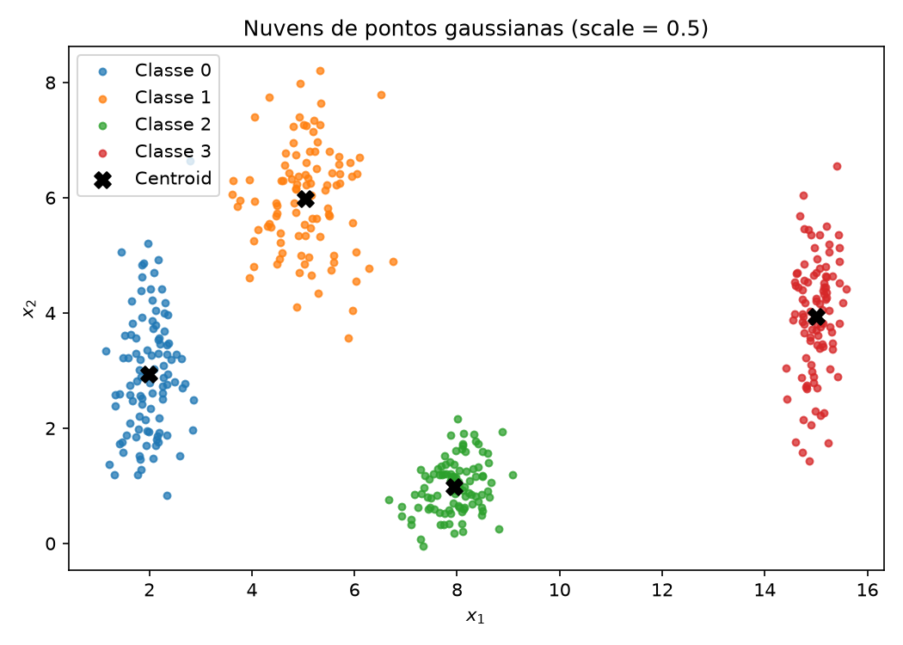
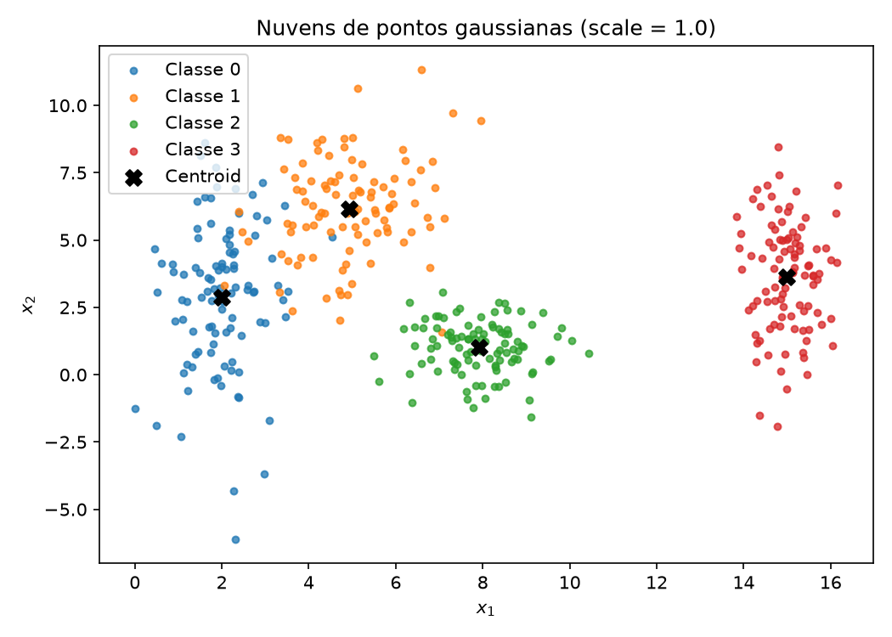
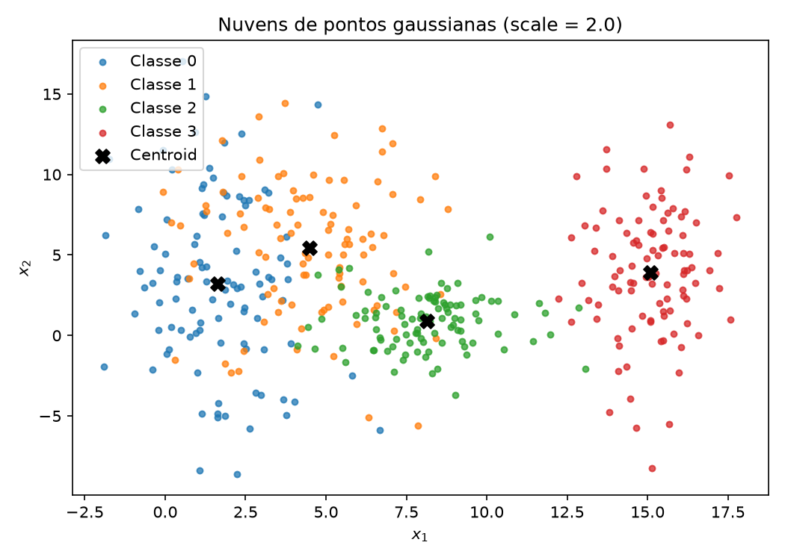
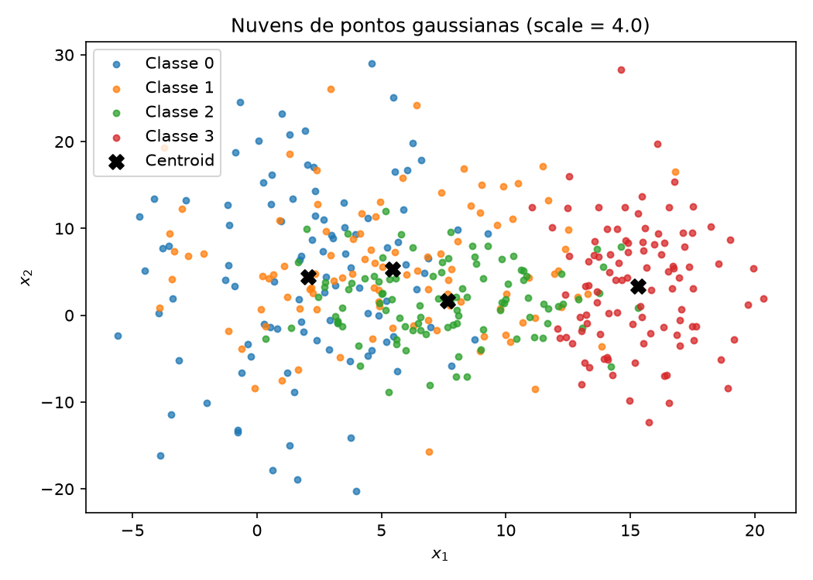
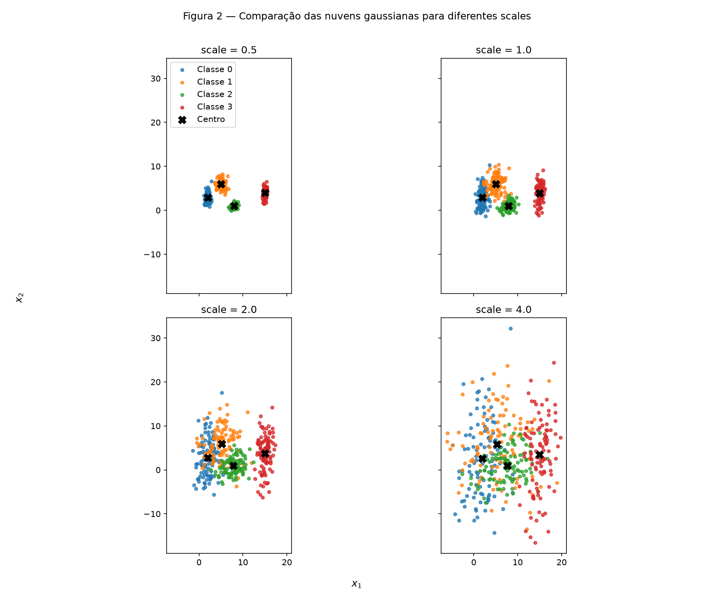
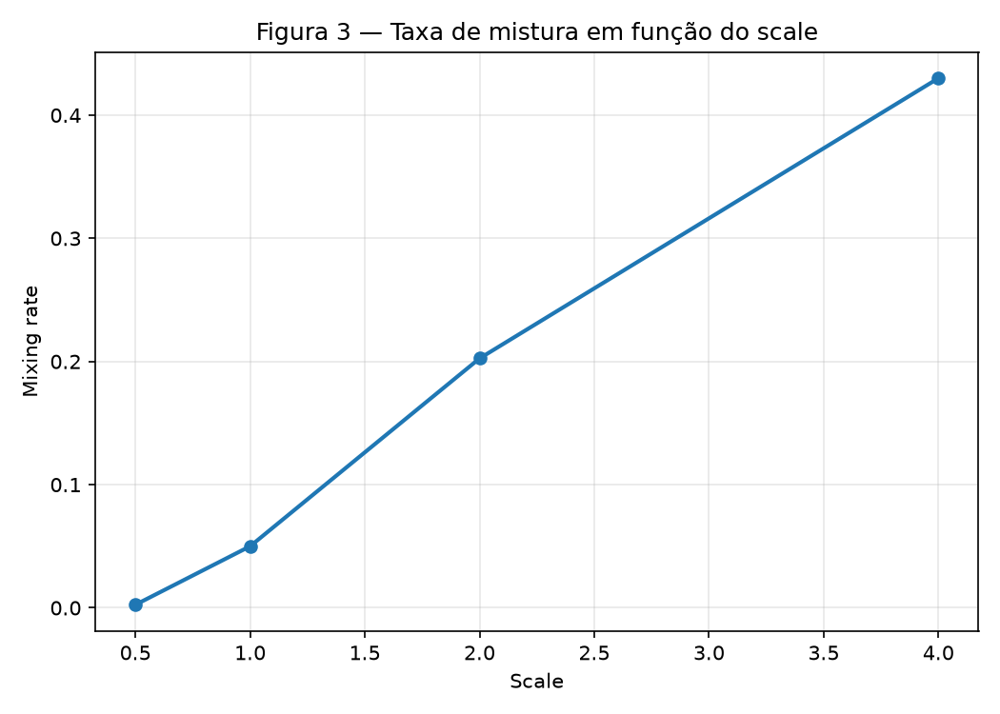
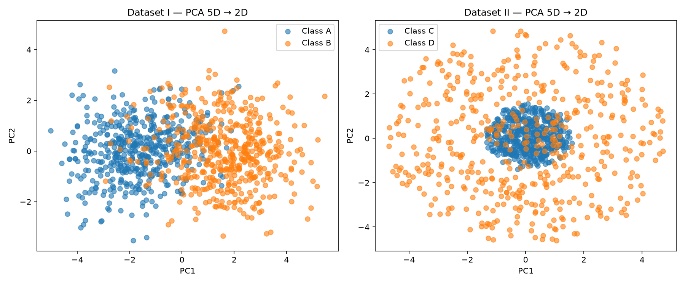
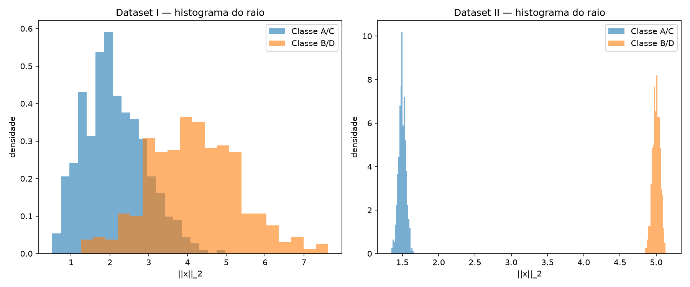
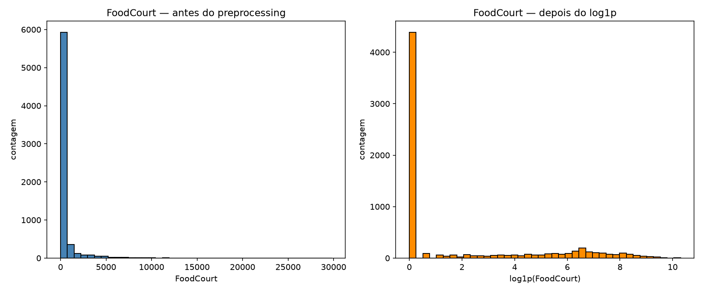

# 1. Data

!!! abstract "Enunciado"

    [Enunciado aqui](https://insper.github.io/ann-dl/2026.2/exercises/data/)

## Exercise 1

### Abordagem

Neste exercício gerei quatro nuvens gaussianas com a mesma semente fixa (`rng = np.random.default_rng(42)`) para manter os resultados reproduzíveis. Primeiro, gerei o dataset base com 4 classes e 100 pontos por classe; depois, gerei o mesmo conjunto quatro vezes com fatores de escala `0.5`, `1.0`, `2.0` e `4.0`, mantendo as médias fixas e variando apenas os desvios.

### Código

``` { .python .copy .select linenums='1' title="docs/exercises/data/code/exercise1_point_clouds.py" }
--8<-- "docs/exercises/data/code/exercise1_point_clouds.py"
```

``` { .python .copy .select linenums='1' title="docs/exercises/data/code/exercise1_multiple_spreads.py" }
--8<-- "docs/exercises/data/code/exercise1_multiple_spreads.py"
```

1.  A semente foi fixada em `42` para garantir reprodutibilidade.
2.  O script `exercise1_multiple_spreads.py` gera quatro datasets determinísticos usando o mesmo ruído base, em vez de reutilizar um único gerador em sequência.
3.  `plt.close(fig)` evita vazamento de figuras ao gerar várias imagens.

### Figuras


/// caption
**Figura 1** — nuvens gaussianas com `scale = 0.5`, com os centros de cada classe marcados.
///


/// caption
**Figura 2** — nuvens gaussianas com `scale = 1.0`, com os centros de cada classe marcados.
///


/// caption
**Figura 3** — nuvens gaussianas com `scale = 2.0`, com os centros de cada classe marcados.
///


/// caption
**Figura 4** — nuvens gaussianas com `scale = 4.0`, com os centros de cada classe marcados.
///


/// caption
**Figura 2** — comparação honesta das quatro escalas com os mesmos limites de eixo.
///


/// caption
**Figura 3** — curva da taxa de mistura por valor de `scale`.
///

### Análise

A separação entre classes piora conforme o `scale` aumenta. No `scale = 1.0`, os seis pares de classes têm os seguintes *separation ratios*:

- `(0,1)` → `2.243`
- `(0,2)` → `4.071`
- `(0,3)` → `7.221`
- `(1,2)` → `3.684`
- `(1,3)` → `5.520`
- `(2,3)` → `5.399`

O menor valor é `2.243`, para o par `(0,1)`. Isso significa que as classes 0 e 1 são as mais próximas geometricamente e, portanto, as que mais se misturam primeiro. A taxa de mistura medida pelo centro mais próximo foi:

- `scale = 0.5` → `0.003` (0.3%)
- `scale = 1.0` → `0.050` (5.0%)
- `scale = 2.0` → `0.203` (20.3%)
- `scale = 4.0` → `0.430` (43.0%)

A primeira escala em que o menor *separation ratio* fica abaixo de `1.0` é `scale = 4.0`, onde ele passa a `0.605`. Nesse ponto, as nuvens já estão tão espalhadas que a separação por retas deixa de ser confiável; a taxa de mistura também é alta (`43.0%`).

## Exercise 2

### Abordagem

Aqui gerei dois datasets em 5 dimensões. O primeiro é um par de gaussianas deslocadas com covariâncias diferentes; o segundo é um conjunto de cascas concêntricas com raios distintos. Em seguida, apliquei PCA para projetar ambos para 2D e comparei a estrutura visualmente.

### Código

``` { .python .copy .select linenums='1' title="docs/exercises/data/code/exercise2_non_linearity.py" }
--8<-- "docs/exercises/data/code/exercise2_non_linearity.py"
```

### Figuras


/// caption
**Figura 4** — projeção PCA para 2D dos datasets I e II. A comparação mostra que o Dataset II mantém uma estrutura radial mesmo após a redução.
///


/// caption
**Figura 5** — histogramas de `||x||_2` para os dois datasets, mostrando a separação radial do Dataset II.
///

### Análise

No Dataset I, a distância entre centros vale `3.264` e a variância explicada por PC1 + PC2 vale `0.6704`. No Dataset II, a distância entre centros é muito menor, `0.265`, mas a estrutura não deixa de existir: os raios médios são distintos (`1.496` para a classe interna e `5.001` para a classe externa). Isso mostra que a separação está no módulo do vetor, não na posição relativa entre médias.

O Dataset II não é linearmente separável por um hiperplano porque a regra de decisão depende de `||x||_2`, isto é, de uma função não linear do vetor de entrada. Um separador linear só consegue dividir o espaço por um plano, mas as cascas concêntricas exigem uma fronteira radial. A PCA é linear, então uma projeção 2D que pareça mista não prova que os dados são inseparáveis no espaço original; ao contrário, o resultado acima mostra que a estrutura radial pode ser preservada em termos de raio, mesmo com centros próximos.

## Exercise 3

### Abordagem

Neste exercício usei o dataset real `Spaceship Titanic` para aplicar a sequência correta de preparação para uma rede com `tanh`: `train_test_split` primeiro, depois imputação, encoding categórico, engenharia de feature e escalonamento. Também apliquei `log1p` nas colunas de gasto para reduzir a cauda pesada e manter os valores mais compatíveis com a escala de `tanh`.

### Código

``` { .python .copy .select linenums='1' title="docs/exercises/data/code/exercise3_spaceship_titanic.py" }
--8<-- "docs/exercises/data/code/exercise3_spaceship_titanic.py"
```

### Figuras


/// caption
**Figura 6** — histograma da feature `FoodCourt` antes e depois da transformação `log1p`.
///

### Análise

O objetivo do dataset é prever a coluna `Transported`, que indica se o passageiro foi transportado para outra dimensão. A classe positiva representa `50.36%` dos exemplos, enquanto a negativa representa `49.64%`, ou seja, há um equilíbrio quase perfeito.

As colunas com mais valores ausentes são `CryoSleep` (`217`), `ShoppingMall` (`208`), `VIP` (`203`), `HomePlanet` (`201`) e `Name` (`200`). Em porcentagem, os maiores percentuais de faltantes estão em `CryoSleep` (`2.50%`), `ShoppingMall` (`2.39%`), `VIP` (`2.34%`) e `HomePlanet` (`2.31%`).

Para as colunas de gasto (`RoomService`, `FoodCourt`, `ShoppingMall`, `Spa`, `VRDeck`), os valores observados foram:

- `RoomService`: média `224.69`, mediana `0.0`, máximo `14327.0`
- `FoodCourt`: média `458.08`, mediana `0.0`, máximo `29813.0`
- `ShoppingMall`: média `173.73`, mediana `0.0`, máximo `23492.0`
- `Spa`: média `311.14`, mediana `0.0`, máximo `22408.0`
- `VRDeck`: média `304.85`, mediana `0.0`, máximo `24133.0`

Essas médias muito maiores que as medianas indicam distribuições fortemente enviesadas para a direita, com cauda pesada e muitos valores iguais a zero. A transformação `log1p` ajuda porque comprime a variância dessas caudas e torna os valores mais adequados para entradas de uma camada escondida com `tanh`.

A estratégia de preprocessamento aplicada foi:

- valores numéricos faltantes: imputação por mediana;
- valores categóricos faltantes: imputação pela categoria mais frequente;
- categóricas: `OneHotEncoder(handle_unknown='ignore')`;
- feature engineering: `TotalSpend` foi criada como soma das cinco colunas de gasto e as colunas `Cabin`, `Name` e `PassengerId` foram removidas;
- escalonamento: `StandardScaler`, produzindo entradas com média zero e desvio padrão unitário.

O resultado final foi:

- treino: `(6954, 16)`
- teste: `(1739, 16)`
- sem `NaN` restantes em treino nem em teste;
- faixa após o escalonamento: treino e teste em `[-6.5373, 6.5373]`.

A decisão que mais afeta o treinamento da rede é a transformação dos gastos, porque a distribuição desses campos é extremamente assimétrica e, sem compressão, o `tanh` tende a operar em regiões saturadas. A imputação e o encoding também são importantes, mas o `log1p` foi o passo que mais melhorou a compatibilidade da distribuição de entrada com a função de ativação.

## Results summary

| # | Métrica | Valor |
|---|---------|-------|
| 1 | Mixing rate (`scale = 0.5`) | `0.003` |
| 2 | Mixing rate (`scale = 1.0`) | `0.050` |
| 3 | Mixing rate (`scale = 2.0`) | `0.203` |
| 4 | Mixing rate (`scale = 4.0`) | `0.430` |
| 5 | Menor separation ratio em `scale = 1.0` e par | `2.243` (classes `(0,1)`) |
| 6 | Distância entre centros — Dataset I | `3.264` |
| 7 | Distância entre centros — Dataset II | `0.265` |
| 8 | Variância explicada — PC1 + PC2 (Dataset I) | `0.6704` |
| 9 | Variância explicada — PC1 + PC2 (Dataset II) | `0.4290` |
| 10 | Fração da classe positiva em `Transported` | `0.503624` |
| 11 | Média e mediana de `FoodCourt` no treino | média `458.077203`, mediana `0.0` |
| 12 | Shape final da matriz de treino | `(6954, 16)` |
| 13 | Faixa após escalonamento (treino/teste) | treino/teste em `[-6.5373, 6.5373]` |

## Discussão

A parte mais difícil foi interpretar a diferença entre separação geométrica e separação linear. No Dataset II, os centros estão muito próximos, mas a estrutura radial faz com que uma fronteira linear falhe mesmo sem falta de dados; isso reforça a ideia de que não basta olhar para médias, é preciso entender a geometria do conjunto.

## Conclusão

Este exercício mostrou que a distribuição dos dados e a geometria da nuvem determinam a complexidade da fronteira de decisão. Em `Exercise 1`, o aumento de `scale` eleva a mistura entre classes e faz a separação por retas perder utilidade. Em `Exercise 2`, a estrutura radial de Dataset II exige uma regra não linear, mesmo com centros próximos. Em `Exercise 3`, a preparação correta dos dados — especialmente a transformação dos gastos e o escalonamento — é essencial para que a rede com `tanh` treine de forma estável e eficiente.
