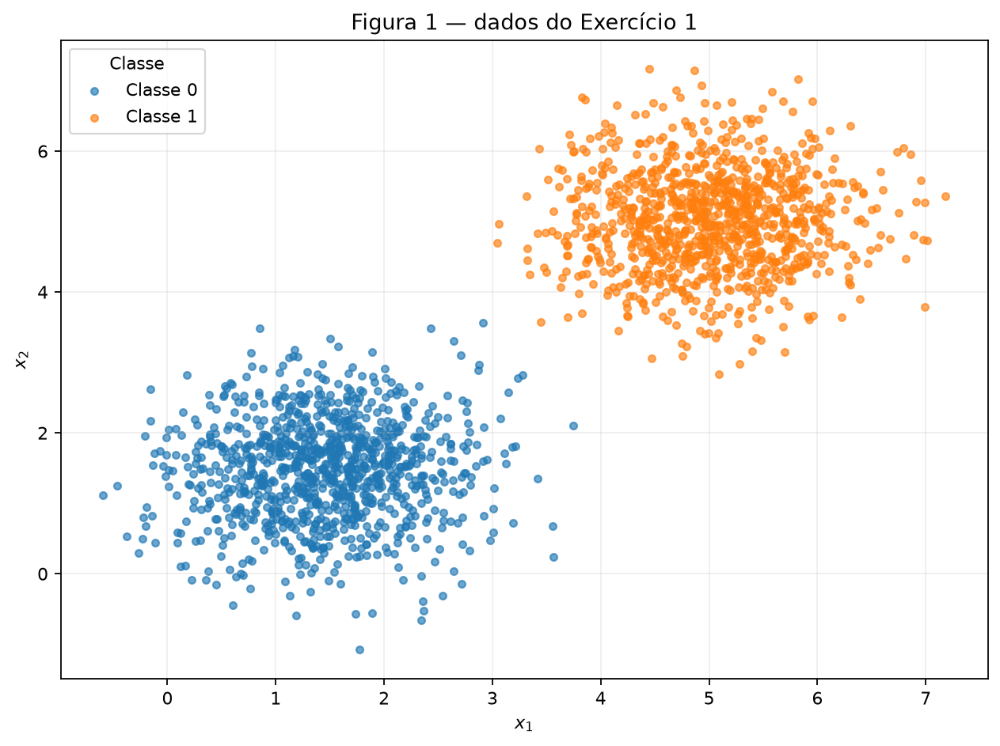
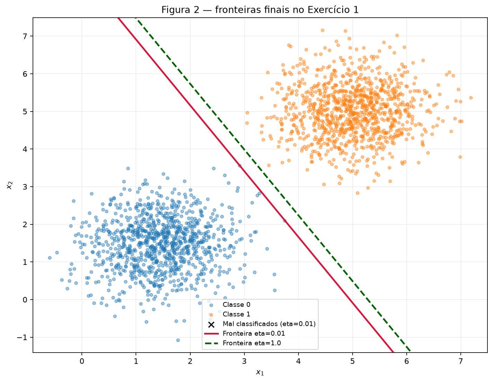
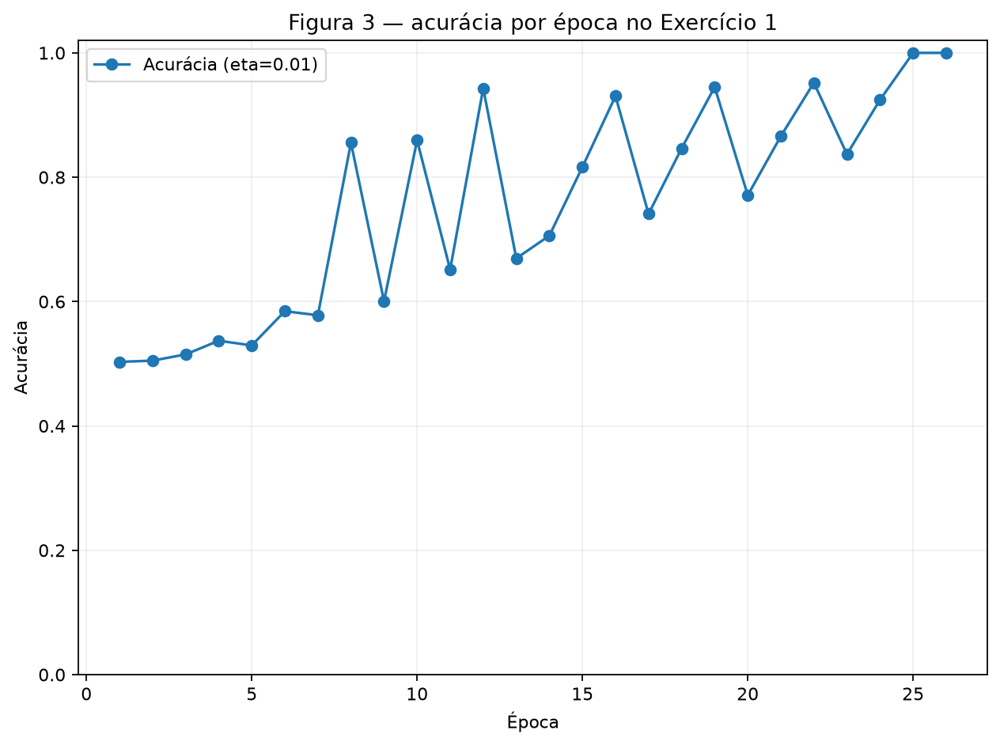
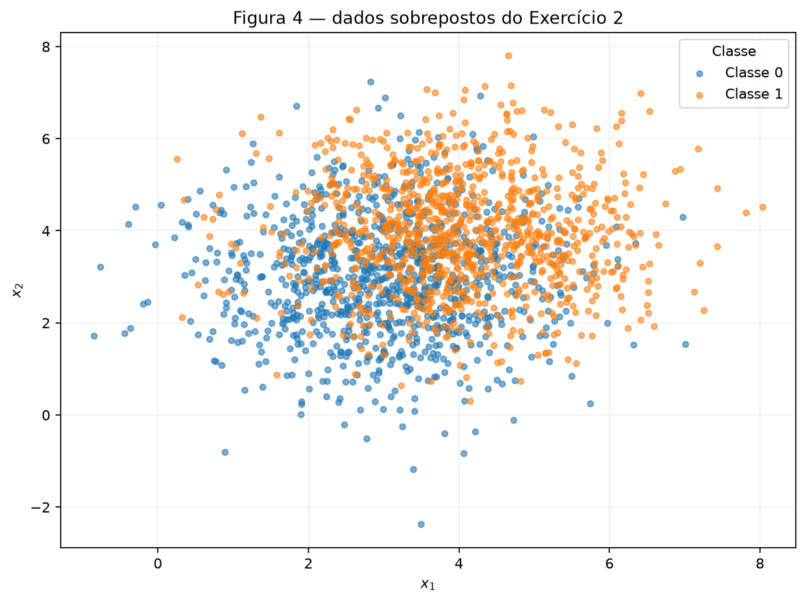
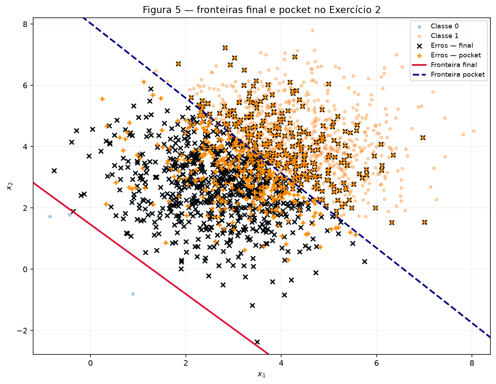
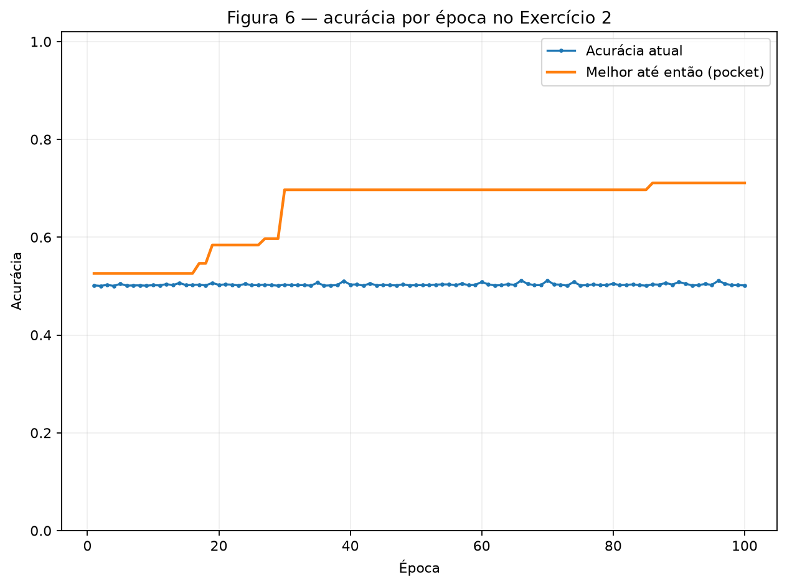

# 2. Perceptron

!!! abstract "Enunciado"

    [Exercises → Perceptron](https://insper.github.io/ann-dl/){:target='_blank'}

## Abordagem e reprodutibilidade

Implementei um perceptron binário do zero e reutilizei a mesma função nos dois conjuntos. O [notebook executável](https://github.com/laupontiroli/DeepLearning-CLASS/blob/main/docs/exercises/perceptron/code/perceptron_activity.ipynb) contém a sequência, os gráficos e a tabela produzida pelos resultados; o módulo-fonte comentado está logo abaixo.

O gerador único é `rng = np.random.default_rng(42)`. A ordem foi mantida exatamente: dados do Exercício 1, inicialização do Exercício 1, dados do Exercício 2 e inicialização do Exercício 2. Cada conjunto contém 1.000 exemplos por classe, classe 0 antes da classe 1 e sem embaralhamento. O notebook usa apenas NumPy, pandas e Matplotlib para esses experimentos; não usa um estimador pronto.

## Código

O código de geração e treinamento está em `code/perceptron.py`; as rotinas de visualização e chamadas de execução estão no notebook vinculado acima.

<!-- markdownlint-disable MD046 -->
``` { .python .copy .select linenums='1' title="docs/exercises/perceptron/code/perceptron.py" }
--8<-- "docs/exercises/perceptron/code/perceptron.py"
```
<!-- markdownlint-enable MD046 -->

## Exercise 1

### A — Generate the data (separable dataset)

Gerei duas gaussianas bidimensionais com 1.000 pontos cada: classe 0 com média $[1.5,1.5]$, classe 1 com média $[5,5]$ e covariância $0.5I$ para ambas. Mantive os pontos na ordem da geração, sem embaralhamento.


/// caption
**Figura 1** — os 2.000 exemplos do conjunto separável, coloridos por classe.
///

### B — Implement the perceptron

A previsão é $\hat y=1$ quando $w\cdot x+b\geq0$ e 0 caso contrário. Para cada ponto, usei $e=y-\hat y$, $w\leftarrow w+\eta e x$ e $b\leftarrow b+\eta e$. Assim, acertos não alteram os parâmetros. O processamento segue a ordem dos dados e termina após uma época inteira sem atualizações ou ao alcançar 100 épocas. Registrei a acurácia sobre os 2.000 exemplos ao final de cada época e o número de atualizações por época.

### C — Train and measure

Na execução principal ($\eta=0.01$), os pesos finais foram $w=[0.05049707,\ 0.02887168]$, o bias $b=-0.25$, a norma $\|w\|=0.05816810$ e a direção normalizada $w/\|w\|=[0.86812305,\ 0.49634905]$. O treinamento terminou em 26 épocas, com acurácia final de 100%.

Na repetição com $\eta=1.0$, mantendo os dados e a mesma cópia de $w_0$, obtive $w=[5.87061596,\ 3.35923930]$, $b=-31$, $\|w\|=6.76377265$ e $w/\|w\|=[0.86794992,\ 0.49665172]$. Foram 37 épocas e a acurácia final também foi 100%.


/// caption
**Figura 2** — fronteiras finais para as duas taxas; os pontos mal classificados da corrida principal são indicados por marcador distinto. A fronteira é traçada com tratamento para $w_2$ próximo de zero.
///


/// caption
**Figura 3** — acurácia ao fim de cada época na execução com $\eta=0.01$.
///

### D — Analysis (Exercise 1)

As atualizações por época para $\eta=0.01$ foram `[3, 3, 4, 4, 3, 4, 3, 4, 2, 4, 2, 4, 2, 3, 3, 3, 2, 3, 3, 2, 3, 3, 2, 3, 1, 0]`; para $\eta=1.0$, foram `[2, 4, 3, 3, 4, 3, 2, 4, 2, 4, 2, 4, 2, 4, 2, 4, 2, 3, 3, 3, 3, 2, 3, 3, 2, 3, 3, 2, 3, 3, 2, 3, 3, 2, 3, 1, 0]`. As contagens oscilam de uma época para outra, mas ambas terminam em zero; em cada atualização ocorreu uma classificação incorreta, e a época final sem atualizações acionou a condição de parada. A acurácia da corrida principal chegou a 100% na época 26.

As direções normalizadas são quase iguais nos valores calculados: `[0.86812305, 0.49634905]` para $\eta=0.01$ e `[0.86794992, 0.49665172]` para $\eta=1.0$. Portanto, os resultados mostram orientações muito próximas, e não uma mudança substancial de ângulo. Já as escalas e os interceptos diferem bastante: $\|w\|$ foi 0.05816810 e 6.76377265, e $b$ foi $-0.25$ e $-31$, respectivamente. As duas fronteiras atingem 100%, mas seus parâmetros não têm a mesma escala nem exatamente o mesmo intercepto.

Isso ocorre porque cada erro soma $\eta e x$ aos pesos, enquanto a inicialização tem magnitude da ordem de $0.01$. Com $\eta=0.01$, a inicialização tem influência relativa maior no caminho; com $\eta=1.0$, as atualizações passam a dominá-la. Nesta amostra, ambas as corridas atingiram 100%, embora em 26 e 37 épocas.

**Caso de início zero.** Se $w_0=0$ e $b_0=0$, a trajetória com taxa $\eta>0$ é $\eta$ vezes a trajetória com taxa 1. A base da indução vale porque ambas começam em zero. Se $(w_t(\eta),b_t(\eta))=\eta(w_t(1),b_t(1))$, a margem é multiplicada por um escalar positivo; portanto, sua condição de não negatividade, as previsões e os erros são iguais. Então

$$w_{t+1}(\eta)=\eta w_t(1)+\eta e x=\eta(w_t(1)+e x)=\eta w_{t+1}(1),\qquad b_{t+1}(\eta)=\eta b_{t+1}(1).$$

Por indução, $w(\eta_2)=(\eta_2/\eta_1)w(\eta_1)$ e o bias também escala pelo mesmo fator. Logo, a fronteira, a sequência de erros e a época de parada são iguais para ambas as taxas: com início zero, $\eta$ não afeta esses resultados. Para uma inicialização geral, $(w,b)(\eta;w_0)=\eta(w,b)(1;w_0/\eta)$; assim, mudar $\eta$ também muda o tamanho efetivo da inicialização.

## Exercise 2

### A — Generate the data (overlapping dataset)

Gerei 1.000 pontos por classe, com médias $[3,3]$ e $[4,4]$ e covariância $1.5I$. Mantive a classe 0 primeiro e não embaralhei os exemplos. As nuvens se sobrepõem amplamente.


/// caption
**Figura 4** — os 2.000 exemplos sobrepostos, coloridos por classe.
///

### B — Train, keeping the best weights

Reutilizei a implementação sem modificá-la e ativei apenas a opção pocket, com $\eta=0.01$, inicialização nova e limite de 100 épocas. Após cada atualização, calculei a acurácia sobre todo o conjunto; quando ela superou estritamente a melhor acurácia anterior, salvei cópias de $w$ e $b$ e a época correspondente.

Ao final da época 100, os pesos finais foram $w=[0.05448404,\ 0.04804330]$, $b=-0.07$ e a acurácia foi 50.15%. O melhor pocket ocorreu na época 86, com $w=[0.01066397,\ 0.00872652]$, $b=-0.07$ e acurácia de 71.10%.

### C — Figures


/// caption
**Figura 5** — fronteiras final e pocket, com os pontos incorretos de cada configuração indicados por marcadores diferentes.
///


/// caption
**Figura 6** — acurácia dos pesos atuais e melhor acurácia pocket observada até cada época.
///

### D — Analysis (Exercise 2)

A acurácia de 50.15% dos pesos finais fica próxima do acaso, enquanto o snapshot pocket alcançou 71.10%. Na Figura 5, a fronteira final está abaixo da maior parte da nuvem: ela prediz classe 1 para quase todos os pontos, o que explica a acurácia próxima de 50% em um conjunto balanceado. A fronteira pocket, por outro lado, atravessa a região central de sobreposição e captura a melhor configuração visitada. A última iteração é apenas o estado deixado pelo último erro; a função não seleciona esse estado para maximizar acurácia. A pocket conserva o melhor snapshot encontrado.

Na Figura 3, a acurácia do conjunto separável termina em 100%, após a época sem atualizações. Na Figura 6, a acurácia corrente do conjunto sobreposto oscila em torno de 50%, enquanto o melhor valor acumulado aumenta em degraus e chega a 71.10%. O teorema de convergência do perceptron garante convergência em número finito de atualizações quando os dados são linearmente separáveis (e limitados). A sobreposição do Exercício 2 não satisfaz a hipótese de separabilidade; por isso, os erros continuam ocorrendo durante as 100 épocas executadas.

Mais épocas não garantem correção: o treinamento continua respondendo aos erros e a última configuração pode continuar arbitrária, embora a pocket possa melhorar por acaso. Reduzir $\eta$ diminui o tamanho das atualizações em relação à inicialização corrente, mas não cria um hiperplano que separe os dados; portanto, também não garante que os erros desapareçam.

## Results summary

| # | Métrica | Valor |
| --- | --------- | ------- |
| 1 | Exercise 1 — final $w$ e $b$ ($\eta=0.01$) | $w=[0.05049707,\ 0.02887168]$, $b=-0.25$ |
| 2 | Exercise 1 — épocas até convergência | 26 |
| 3 | Exercise 1 — acurácia final ($\eta=0.01$) | 100% |
| 4 | Exercise 1 — épocas e acurácia com $\eta=1.0$ | 37 épocas; 100% |
| 5 | Exercise 2 — pesos finais $w$ e $b$ | $w=[0.05448404,\ 0.04804330]$, $b=-0.07$ |
| 6 | Exercise 2 — acurácia dos pesos finais | 50.15% |
| 7 | Exercise 2 — acurácia dos pesos pocket | 71.10% |
| 8 | Exercise 2 — época do melhor pocket | 86 |
